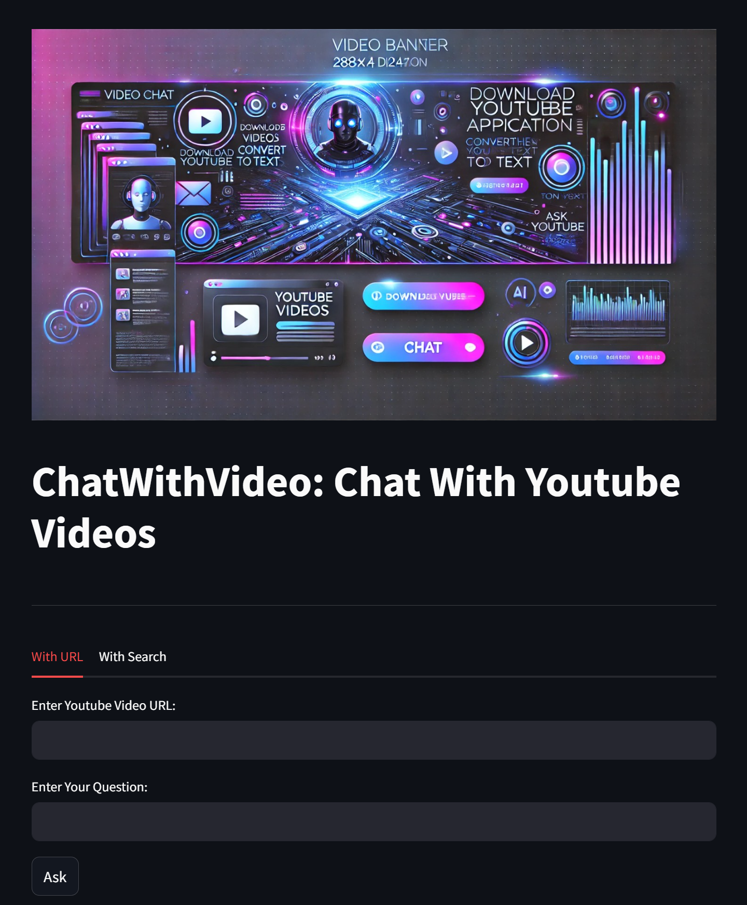
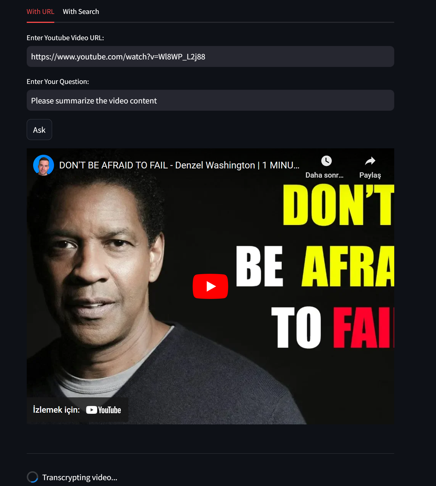
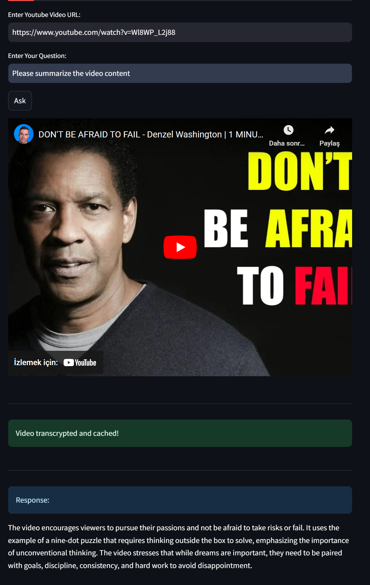
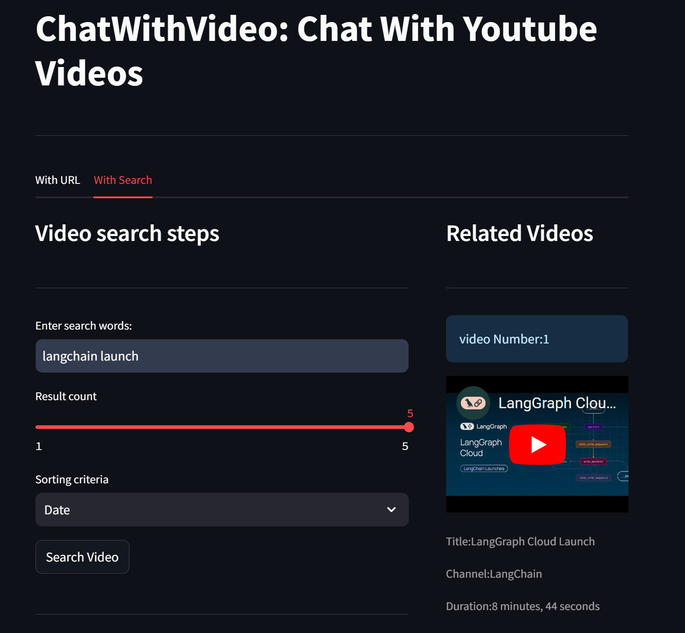
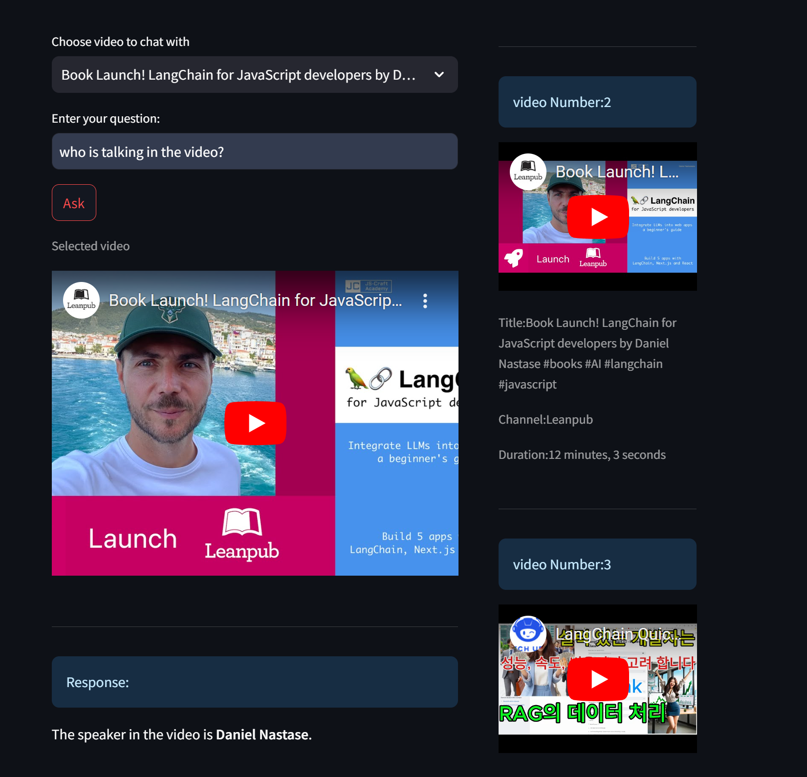

# Chat with YouTube Video

It is a powerful application that allows you to interact with YouTube videos by converting them into text and asking questions about their content. This app leverages OpenAI's Whisper for speech-to-text conversion, LangChain's Retrieval Augmented Generation (RAG) for answering questions about the video, and Gemini Pro as the underlying chat model.

## Features

- **URL Input (With URL Tab):** Input a YouTube video URL, convert its audio to text, and ask questions about the video using a sophisticated question-answering model.
- **YouTube Search (With Search Tab):** Perform a YouTube search based on specific keywords, select a video from the results, and ask questions about its content.
- **AI Models Used:**
  - **Speech-to-Text:** OpenAI's Whisper model for converting video audio into text.
  - **Chat Model:** Gemini Pro for generating natural, accurate answers to your questions.
  - **Question Answering:** LangChain's Retrieval Augmented Generation (RAG) framework for document-based Q&A on the video's text.

## Screenshots

|  |  |
| ---------------------------------- | ---------------------------------- |
|  |  |

## Installation

1. Clone the repository:
    ```bash
    git clone https://github.com/yourusername/video2text-qa.git
    cd video2text-qa
    ```

2. Install the required packages:
    ```bash
    pip install -r requirements.txt
    ```

3. Install **FFmpeg** (required for audio processing):
    - **Windows:** Download and install from [FFmpeg official site](https://ffmpeg.org/download.html), and ensure FFmpeg is added to your system's PATH.
    - **Linux:** Install via package manager, e.g., `sudo apt install ffmpeg`.
    - **Mac:** Use Homebrew to install, `brew install ffmpeg`.

## Usage

### With URL Tab
1. **Enter Video URL:**
    - Paste a YouTube video URL into the input field.
    - The video’s audio will be automatically extracted, converted into text using OpenAI's Whisper.

2. **Ask Questions:**
    - Once the text is generated, you can ask questions about the video using the Gemini Pro chat model, enhanced by LangChain's RAG for better retrieval and answers.

### With Search Tab
1. **Search for a YouTube Video:**
    - Enter search criteria to find YouTube videos.
    - Select a video from the search results.

2. **Ask Questions:**
    - The video’s audio will be converted to text, and you can ask questions just as in the URL tab.

## License

This project is licensed under the MIT License - see the [LICENSE](LICENSE) file for details.

## Contact

For any questions or feedback, please contact [kanitvural@gmail.com](kanitvural@gmail.com).
